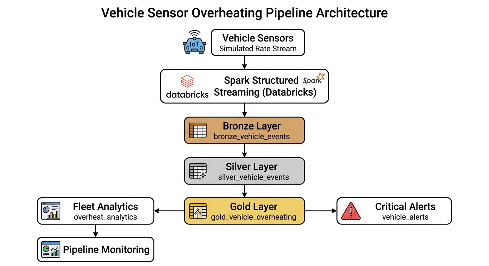

# Vehicle Telemetry Streaming Data Platform

A real-time vehicle telemetry data pipeline built using **Databricks Structured Streaming and Delta Lake** following a **Medallion Architecture (Bronze → Silver → Gold)**.

## Architecture



## Pipeline Overview

This project simulates vehicle telemetry data and processes it through multiple layers.

### Bronze Layer
Raw streaming telemetry events.

Table:
```
bronze_vehicle_events
```

### Silver Layer
Cleaned and validated telemetry data.

Validation rules:
- speed between 0–160 km/h
- engine_temp between 70–120 °C
- vehicle_id must not be null

Table:
```
silver_vehicle_events
```

### Gold Layer

#### Overheating Event Detection
Detect vehicles with engine temperature > 100°C.

Table:
```
gold_vehicle_overheating
```

#### Fleet Analytics
Hourly analytics for overheating events.

Table:
```
gold_vehicle_overheat_analytics
```

#### Critical Alert Detection
Detect severe overheating events.

Rule:
```
engine_temp > 115
```

Table:
```
gold_vehicle_alerts
```

#### Pipeline Monitoring
Tracks pipeline execution metrics.

Table:
```
pipeline_monitoring
```

## Technologies Used

- Apache Spark Structured Streaming
- Delta Lake
- Databricks Community Edition
- PySpark

## Concepts Demonstrated

- Streaming Data Pipelines
- Medallion Architecture
- Event Detection
- Window Aggregations
- Delta Lake Tables
- Pipeline Monitoring
